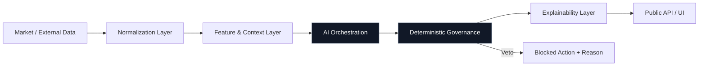

# CoreX Capital AI — Public Reference Repository

[](https://corexcapitalai.com/)
[](https://corexsignalai.com/)
[](docs/PUBLIC_BOUNDARY.md)
[](LICENSE.md)

> **Public reference edition.** This repository documents and demonstrates the public-facing architecture, product concepts, interface patterns, and integration contracts of CoreX Capital AI. It intentionally excludes proprietary trading logic, model weights, private infrastructure, credentials, broker execution code, internal datasets, and licensed third-party charting code.

## Overview

CoreX Capital AI is a fintech/AI infrastructure platform focused on combining agentic intelligence with deterministic execution and governance layers. The public product surface is organized around four concepts:

- **Physics Core** — deterministic control and execution concepts used as a governance layer.
- **CoreX Signal AI** — explainable market-intelligence and signal presentation.
- **Strategy OS™** — a framework for translating rule-based strategy intent into machine-readable workflows.
- **Autonomous Veto Protocol** — risk and policy gates designed to block actions that fail deterministic checks.

This repository is designed for technical evaluation, product discovery, integration planning, and security review without exposing the proprietary engine.

## Public architecture



The diagram is intentionally high-level. Internal algorithms, thresholds, model artifacts, execution routing, and private infrastructure are not part of the public repository.

## Repository map

| Path | Purpose |
| --- | --- |
| [`site/`](site/) | Static public product/architecture showcase; no private runtime dependencies |
| [`docs/`](docs/) | Product, architecture, security, API, public-boundary and roadmap documentation |
| [`openapi/`](openapi/) | Public-safe illustrative API contract |
| [`examples/`](examples/) | Read-only sample payloads and demo clients using synthetic data |
| [`scripts/`](scripts/) | Repository validation and public-boundary checks |
| [`.github/`](.github/) | CI, Pages deployment, issue and pull-request templates |

## Quick start

### 1. Preview the public site

No package manager or build step is required.

```bash
python -m http.server 8080 --directory site
```

Open `http://localhost:8080`.

### 2. Run the local mock API

The mock server uses Python's standard library only and returns synthetic, illustrative payloads.

```bash
python examples/mock_server.py
```

Then try:

```bash
curl http://127.0.0.1:8787/v1/health
curl http://127.0.0.1:8787/v1/system
curl http://127.0.0.1:8787/v1/signals/example
```

### 3. Validate the public repository

```bash
python scripts/validate_public_repo.py
```

The validator checks required public files and scans tracked text for common secret patterns and explicitly disallowed private artifacts.

## API philosophy

The public contract is deliberately **read-only and illustrative**. It demonstrates how a consumer could receive health, system-capability, and explainability-oriented signal objects without publishing proprietary inference or execution logic.

See [`openapi/public-api.yaml`](openapi/public-api.yaml) and [`docs/API.md`](docs/API.md).

## Security and disclosure

- Never commit credentials, API keys, account identifiers, private datasets, model weights, broker secrets, or production configuration.
- Do not publish licensed third-party source code or private charting integration code.
- Security reports should follow [`SECURITY.md`](SECURITY.md).
- The exact public/private boundary is defined in [`docs/PUBLIC_BOUNDARY.md`](docs/PUBLIC_BOUNDARY.md).

## Important disclosures

The interfaces, telemetry, signals, metrics, prices, confidence values, risk values, and performance-style figures shown in this repository are **synthetic or illustrative unless explicitly identified otherwise**. They are not live account data, audited performance, investment advice, a solicitation, or a guarantee of future results.

CoreX Capital AI is not represented by this repository as a broker, exchange, custodian, or licensed investment adviser. Regulatory obligations depend on product, jurisdiction, deployment model, and customer use case.

Third-party trademarks belong to their respective owners. Their mention does not imply endorsement.

## Public websites

- Product: https://corexcapitalai.com/
- Live ecosystem: https://corexsignalai.com/

## Status

This repository is the canonical **public reference surface** for CoreX Capital AI. Proprietary production systems are maintained separately and are intentionally out of scope.

---

Copyright © 2026 CoreX Capital AI. All rights reserved.
