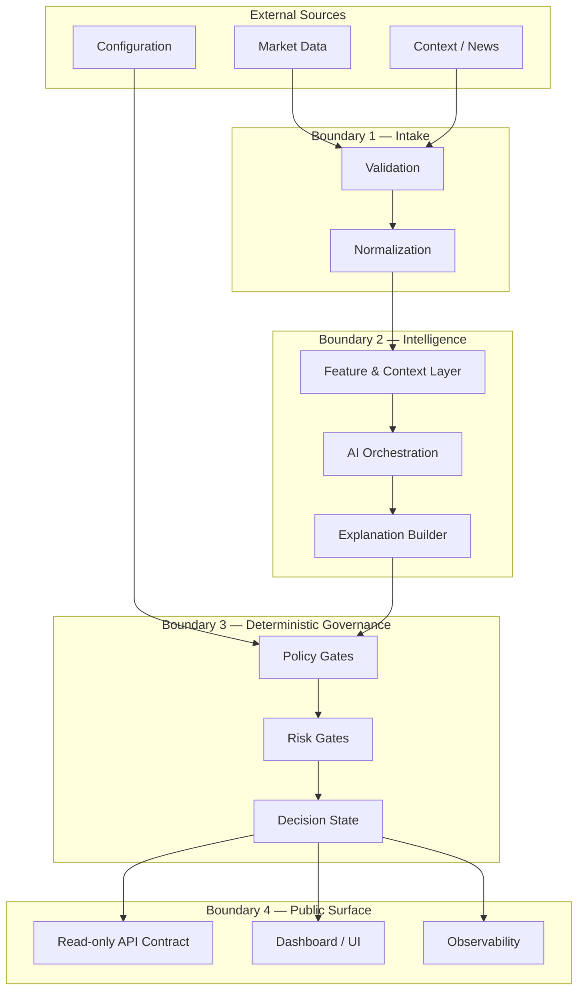
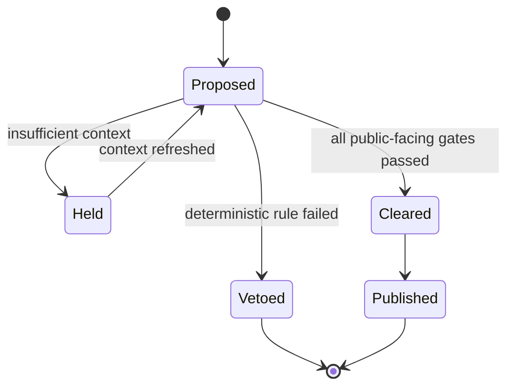

# Public Reference Architecture

This document defines a public-safe architecture for discussing CoreX Capital AI without exposing private implementation details.

## Boundary responsibilities

### 1. Intake

Validate timestamps, symbols, schema, data type, and freshness before any downstream use. The reference design assumes malformed or stale inputs are rejected rather than silently repaired.

### 2. Intelligence

The AI layer may combine contextual and quantitative information. The public contract deliberately does not prescribe algorithms, model families, features, weights, training data, or decision thresholds.

### 3. Deterministic governance

Governance is represented as a separate layer from model inference. A model can produce a high-confidence recommendation that is still blocked by deterministic policy or risk rules. Public outputs should surface the final state and a reason code.

### 4. Public surface

The public surface exposes sanitized, versioned objects suitable for UI and integration prototypes. It contains no order-routing or private control-plane endpoints.

## Decision state model

`Cleared` in this public model means only that the illustrative governance state passed. It is not a recommendation to trade and does not imply that a production execution system will act.

## Data minimization

Public objects should contain only fields required for product demonstration and integration planning. Avoid production hostnames, account identifiers, internal queue names, credentials, raw user data, exact proprietary thresholds, and model artifacts.
