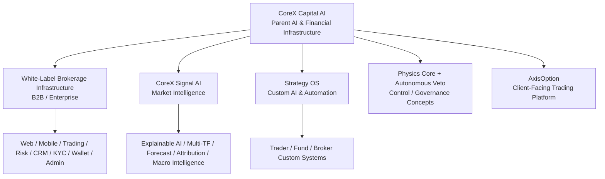
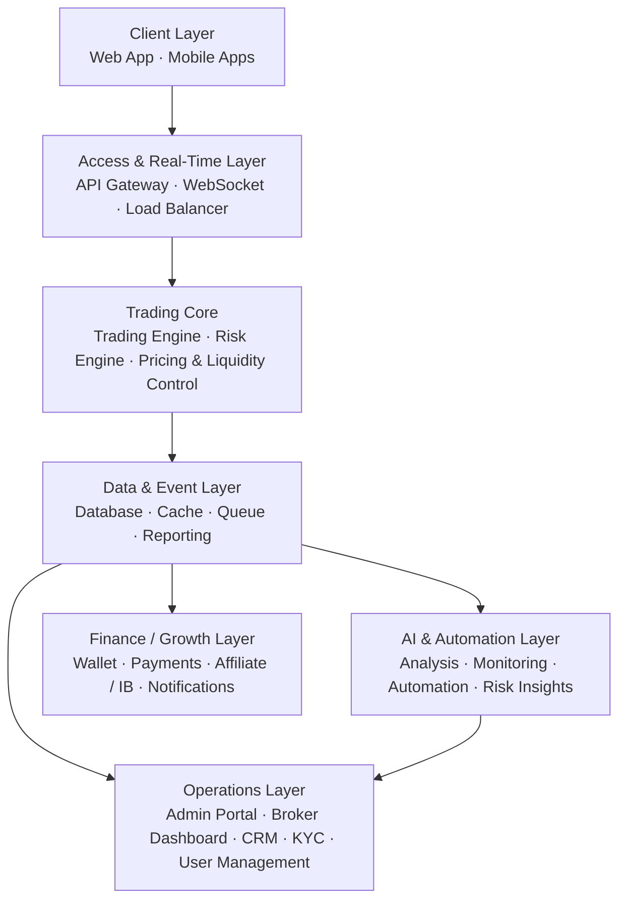
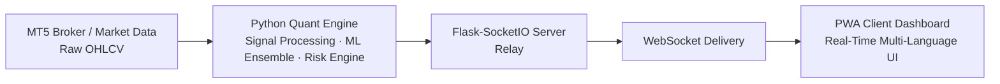
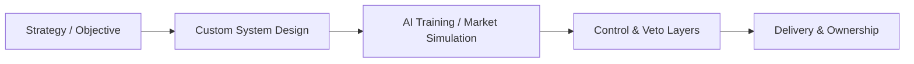
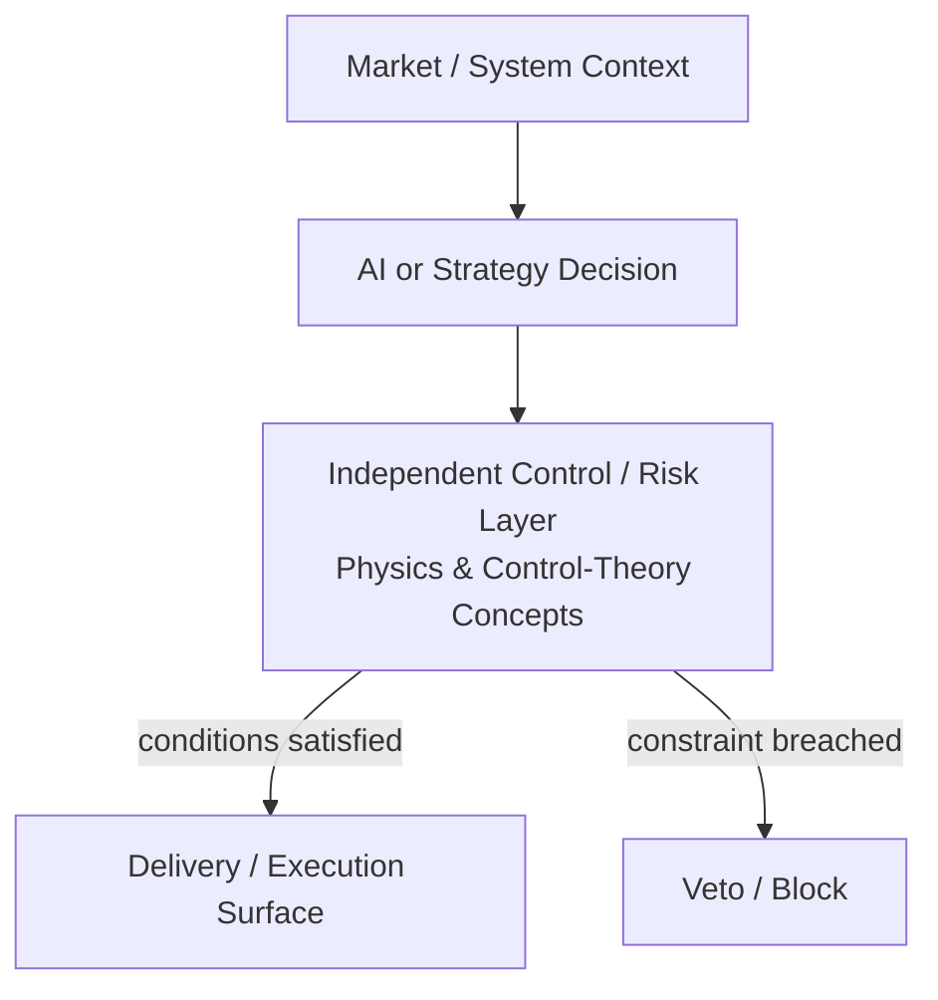

# Publicly Documented Architecture

This document consolidates architecture information that CoreX Capital AI, CoreX Signal AI and AxisOption publish on their official public websites. It is a **public ecosystem map**, not a reconstruction of private source code or production topology.

## 1. Ecosystem-level view

This diagram shows product relationships only. It does not imply that every product shares the same runtime, database, deployment or execution path.

## 2. White-label brokerage architecture

The CoreX white-label product publicly describes a layered brokerage platform organized approximately as follows:

### Client layer

- branded responsive web trading platform;
- mobile applications / native-quality mobile experience;
- live prices, balances, positions and trade history;
- configurable notifications and localization.

### Access and real-time delivery

- API Gateway;
- persistent WebSocket connections;
- load balancing;
- documented REST API surface for third-party and internal integrations.

### Trading and risk core

- trading engine;
- risk engine;
- pricing and liquidity-control layer;
- real-time position and risk calculations;
- configurable trading and exposure rules.

### Operations

- administration portal;
- broker operational dashboard;
- CRM;
- KYC/document verification;
- multi-admin RBAC and activity logging;
- reporting and compliance-oriented exports.

### Finance and growth

- multi-currency wallet;
- fiat/crypto payment-provider integration;
- deposit/withdrawal workflows and reconciliation;
- affiliate / introducing-broker management;
- multi-channel messaging and notification templates.

## 3. White-label technology stack

Public CoreX documentation lists the following infrastructure concepts.

### Real-time systems

- WebSocket infrastructure;
- Redis for session state, caching and pub/sub;
- asynchronous message queues for event processing;
- low-latency / sub-second trade-processing architecture;
- REST API layer.

### Data and storage

- MongoDB document storage;
- relational / ACID-compliant storage for financial records;
- automated multi-region backups;
- point-in-time recovery capability;
- configurable data-retention policies.

### Scalability and reliability

- horizontal scaling;
- load balancing with health checks and failover;
- container orchestration;
- redundant replicas / auto-failover;
- real-time monitoring;
- structured centralized logging;
- threshold/anomaly-based alerting.

### Security

- multi-factor authentication for operator accounts;
- role-based access control;
- TLS encryption in transit and protection of sensitive stored data;
- signed/token-authenticated APIs, rate limiting and request validation;
- immutable/timestamped audit logs;
- DDoS mitigation, network segmentation and firewall controls.

Official source: https://corexcapitalai.com/white-label.html

## 4. CoreX Signal AI architecture

CoreX Signal AI publicly documents an end-to-end intelligence delivery flow:

The Signal AI page additionally lists:

- multi-timeframe processing;
- explainable factor attribution;
- probabilistic / Monte Carlo forecast surfaces;
- market-regime analysis;
- depth/liquidity visualization;
- macro/NLP intelligence;
- HMAC-SHA256 authentication;
- dual-pipeline delivery;
- atomic data-integrity concepts;
- global CDN / edge delivery.

Official source: https://corexsignalai.com/

## 5. Publicly listed Signal AI technologies / integrations

The CoreX Signal AI technology section names the following external technologies or data platforms:

- MetaTrader 5;
- Bloomberg;
- Refinitiv / LSEG;
- FactSet;
- S&P Global;
- ICE;
- Cloudflare;
- TradingView;
- Binance;
- PostgreSQL;
- Redis;
- MongoDB.

The product itself states that third-party names identify technologies it integrates with and do not imply endorsement.

## 6. Strategy OS™ architecture concept

Strategy OS is publicly described as a custom-engineering process rather than a fixed one-size-fits-all product topology:

Public target groups include individual traders, funds/asset managers, brokers and B2B platforms. Deliverables can include strategy automation, intelligent assistants, custom signal systems, asset-management AI, market simulation/backtesting, pricing engines and broker infrastructure.

Official source: https://corexcapitalai.com/strategy.html

## 7. Governance and control concept

CoreX's public About and Autonomous Veto materials repeatedly separate probabilistic AI from an independent supervisory/control layer.

At a high public level:

The public concept is that model confidence alone does not authorize an operation; independent constraints can block it. This repository does not publish or infer the proprietary implementation, exact thresholds, hardware topology or production rules.

Some dedicated marketing pages use strong or absolute risk language. This public repository does not treat those statements as a guarantee of financial outcome or elimination of investment risk.

Official sources:

- https://corexcapitalai.com/about.html
- https://corexcapitalai.com/veto-protocol.html

## 8. AxisOption's place in the ecosystem

AxisOption is a separate client-facing options platform. Its public website states that the live trading terminal operates on CoreX Capital AI enterprise infrastructure and describes:

- TradingView chart trading;
- one-click order interaction;
- multi-asset access;
- demo and live environments;
- flexible expiry settings;
- published payout/expiry conditions;
- direct 24/7 support.

This document does not infer AxisOption's private backend topology beyond what its public site states.

Official sources:

- https://axisoption.com/
- https://axisoption.com/about.html
- https://axisoption.com/products.html

## 9. Public/private boundary

The diagrams above intentionally exclude:

- production hostnames and network topology;
- credentials, keys and account identifiers;
- private source repositories;
- internal datasets or training corpora;
- model weights and exact decision thresholds;
- proprietary execution / pricing algorithms;
- internal queue/topic names;
- licensed third-party source code, including private charting integrations.

See [`PUBLIC_BOUNDARY.md`](PUBLIC_BOUNDARY.md) for disclosure policy.
